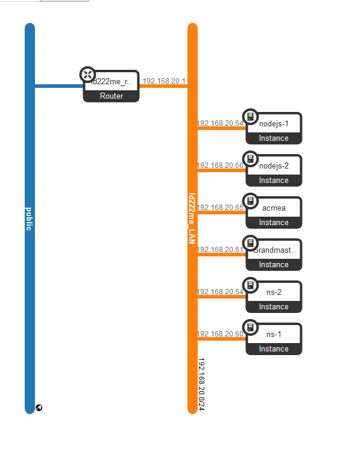

# System Administration Final Examination Project

This repo contains configuration and script files that was part of the final exam of the course System Administration (1dv031). See the [assigment description](./assignment-description.md) for more details.

In short, two **name servers** were set up, two **node servers** running through an **nginx** load balancer, and finally an **Apache server** with Wordpress. The project was built using the university cloud which in turn is built on OpenStack.

## Topology

As shown by the image, all of the servers are connected to the same router. The Apache server (acmea), Nameservers and Nginx (Grandmaster) server all have floating IP's and are accessible from the public. The Nginx server is besides a load balancer and reverse proxy for the Node servers, also used as a jump machine to access the other server within the network. This is probably one of the most simple approaches to completing the task, and is essentially why I chose it. Another I approach I would have taken if time would have allowed, would be letting the Node servers sit on a subnetwork. Further, the Apache server could also have been put "behind" the reverse proxy and as such be more protected. Ideally, TLS/SSL would have been set up as well to ensure both security as well as accessability through any modern browser, as HTTPS is preffered.



## DNS

The task was to create two name servers, one acting as *master* and the other as *slave*.
To achieve this, the Openstack GUI was used to create two Ubuntu servers, "ns1" (master) and "ns2" (slave), each with their own floating IP.
These were accessed through the Grandmaster server through SSH. A security group was created to open port 53.
The nameservers have administrative responsibility of the zone ``ld222me-1dv031.devopslab.xyz`` (delegated by ``devopslab.xyz``). Both servers only allow iterative queries.

### Nameserver 1

1. Edited the name by accessing ``/etc/hostname``.
2. Edited ``/etc/hosts`` by adding a mapping, ``ns1.ld222me-1dv031.devopslab.xyz`` to the local IP of the machine.
3. Update the server with the command ``sudo hostname -F /etc/hostname``
4. Reboot

#### Installing and configuring bind options

1. Install bind: ``sudo apt-get install bind9 bind9utils bind9-doc``
2. Edit the file ``/etc/bind/named.conf.local``
3. Edit the file ``db.ld222me-1dv031.devopslab.xyz`` which contains zone information.

### Nameserver 2

Essentially same steps as nameserver 1, except for mapping to ``ns2`` rather than ``ns1``, and that in ``named.conf.local`` it states that it is a slave, and points to the master.

### A records

A records for acmea and acmeb were added to point to the Apache server and Nginx according to the examination requirements.

```
acmea   IN      A       194.47.176.153
acmeb   IN      A       194.47.176.124
```

## Node.js servers

Two Node instances were set up together with the framework Express.

The process manager PM2 was installed and used to keep the applications running.

```
...
sudo npm install pm2 -g
...
pm2 start app.js
```

## Nginx server

A reverse proxy and load load balancer was set up with Nginx on a Ubuntu server instance. This was achieved by first installing Nginx through ``apt-get``, then creating a configuration file that passes requests to ``acmeb.ld222me-1dv031.devopslab.xyz`` to both of the Node servers, balancing the load.

```
cat > /etc/nginx/conf.d/"$servername".conf <<EOF
upstream backend {
        server $server1;
        server $server2;
}

server {
        listen 80;
        listen [::]:80;

        server_name $servername;

        #root /var/www/html;
        #index index.html index.nginx-debian.html;

        location / {
                proxy_pass http://backend;
        }
}
EOF
```

Finally, the default site was unlinked and the server reloaded.

```
sudo unlink /etc/nginx/sites-enabled/default
sudo nginx -s reload
```

A security group was created on Openstack for port 80 to allow HTTP traffic to the server.

## Apache server

The setup of the Apache server (with WordPress) consisted of four steps (MariaDB/MySQL and PHP are both required for WordPress):

### 1. Installing Apache

In this step, Apache was installed with ``apt-get``.
UFW firewall was enabled and configured for Apache:

```
sudo ufw allow OpenSSH
sudo ufw allow 'Apache Full'
sudo ufw enable -y
```

The default config file ``/etc/apache2/sites-available`` had to be unbound and a new one created with a Directory entry.

```
cd /etc/apache2/sites-available
sudo a2dissite 000-default.conf
sudo cp 000-default.conf ./"$servername".conf

cat > "$servername".conf <<EOF
<VirtualHost *:80>
        ServerAdmin webmaster@localhost
        DocumentRoot /var/www/html/

        ErrorLog ${APACHE_LOG_DIR}/error.log
        CustomLog ${APACHE_LOG_DIR}/access.log combined
        <Directory /var/www/html/>
          AllowOverride All
        </Directory>
</VirtualHost>
EOF
```

### 2. Installing MariaDB

Again, MariaDB was installed through ``apt-get``.
``mysql_secure_installation`` was run, and then MySQL script to create a new database and user for acmea.

```
sudo mysql_secure_installation <<EOF
$password
n
y
y
y
y
EOF
```

```
mysql -uroot <<MYSQL_SCRIPT
CREATE DATABASE acmea;
GRANT ALL PRIVILEGES ON acmea.* TO "acmea"@"localhost" IDENTIFIED BY "ez4ujNcC9ATH8sfC";
FLUSH PRIVILEGES;
MYSQL_SCRIPT
```

### 3. Installing PHP

PHP and additional PHP extensions for both Apache and MySQL were installed.

```
sudo apt-get install php libapache2-mod-php php-mysql -y
```

After that the ``dir.conf`` file was edited to use index.php, which is the WordPress entry page.

```
sed -i 's/index.html/index.php/' /etc/apache2/mods-enabled/dir.conf
sed -i 's/index.php/index.html/2' /etc/apache2/mods-enabled/dir.conf
```

### 4. Installing WordPress

The final step was to install and configure WordPress. Apache was restarted beforehand.
A compressed file containing the latest WordPress installation was fetched with curl from ``wordpress.org``.

```
curl -O https://wordpress.org/latest.tar.gz
tar xzvf latest.tar.gz
```

A wp-config file was edited with adding salts, database name, database user and database password.

```
salt=$(curl -s https://api.wordpress.org/secret-key/1.1/salt/)
echo "$salt" >> /var/www/html/wp-config.php
```

```
sed -i "s/^.*DB_NAME.*$/define('DB_NAME', 'acmea');/" /var/www/html/wp-config.php
sed -i "s/^.*DB_USER.*$/define('DB_USER', 'acmea');/" /var/www/html/wp-config.php
sed -i "s/^.*DB_PASSWORD.*$/define('DB_PASSWORD', '$password');/" /var/www/html/wp-config.php
```

The WordPress folder was then moved to the folder ``/var/www/html`` were the Apache VirtualHost is pointing.

The Apache instance uses the security group for HTTP (port 80).
